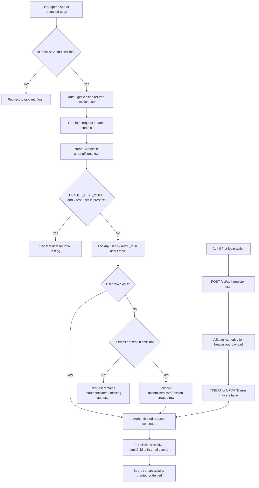

# Authentication Flow

## Notes

- Auth0 is the identity provider.
- The app stores a local `users` record keyed by `auth0_id`.
- `graphql/context.ts` does the main session-to-database lookup.
- `app/api/auth/register-user/route.ts` is the primary registration webhook path.
- Protected routes call `auth0.getSession()` and redirect unauthenticated users to login.
