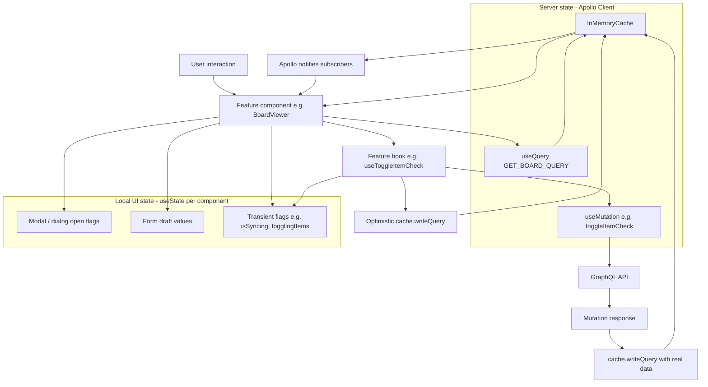

# State Management

This app doesn't use a global client-state library (no Redux, Zustand, Recoil, or React Context for
app-wide state). Instead it splits state into two clear categories:

1. **Server state** — owned by Apollo Client's `InMemoryCache`, treated as the single source of
   truth for anything that comes from the GraphQL API (boards, items, calendar status, shares).
2. **Local/UI state** — owned by `useState` inside individual feature components, scoped to
   transient UI concerns (modal open/closed, form drafts, "is this item currently toggling").

## Where things live

- `src/shared/lib/apollo-client.ts` — server-side Apollo client (RSC / server components)
- `src/shared/lib/apollo-wrapper.tsx` — client-side Apollo provider, cache `typePolicies`, and
  default `fetchPolicy: 'cache-and-network'`
- `src/features/*/api/*.ts` — one custom hook per feature that wraps a mutation with optimistic
  cache reads/writes (e.g. `useToggleItemCheck`, `useDeleteItem`, `useBulkItemActions`)
- `src/widgets/board-viewer/ui/BoardViewer.tsx` — the biggest consumer: composes several feature
  hooks and holds its own local UI state (dialog visibility, selected category, syncing flag)

## Diagram

## Pattern: optimistic updates via feature hooks

Each mutating feature (toggle item, delete item, bulk actions) follows the same shape:

1. Set a local "in-flight" flag (`useState`) so the UI can show a spinner/disabled state
   immediately.
2. Read the current cached query result with `client.cache.readQuery`.
3. Write an optimistic result with `client.cache.writeQuery` so the UI updates instantly.
4. Fire the mutation. In `update()`, re-read the latest cache and reconcile it with the real
   server response.
5. Clear the local in-flight flag in `onCompleted` / `onError`.

See `src/features/toggle-item-check/api/toggle-item-check.ts` for the canonical example.

## Why this split

- Apollo's cache already behaves like a normalized global store for anything fetched from
  GraphQL, so introducing Redux/Zustand on top would duplicate that responsibility.
- UI-only state (is this dialog open, which category is highlighted) has no server
  representation and doesn't belong in the Apollo cache, so it stays local to the component that
  needs it.
- Custom per-feature hooks keep the "how do I update the cache for this mutation" logic next to
  the feature that owns it, consistent with the Feature-Sliced Design layout.

## References

- `src/shared/lib/apollo-client.ts`
- `src/shared/lib/apollo-wrapper.tsx`
- `src/features/toggle-item-check/api/toggle-item-check.ts`
- `src/features/delete-item/api/useDeleteItem.ts`
- `src/widgets/board-viewer/ui/BoardViewer.tsx`
